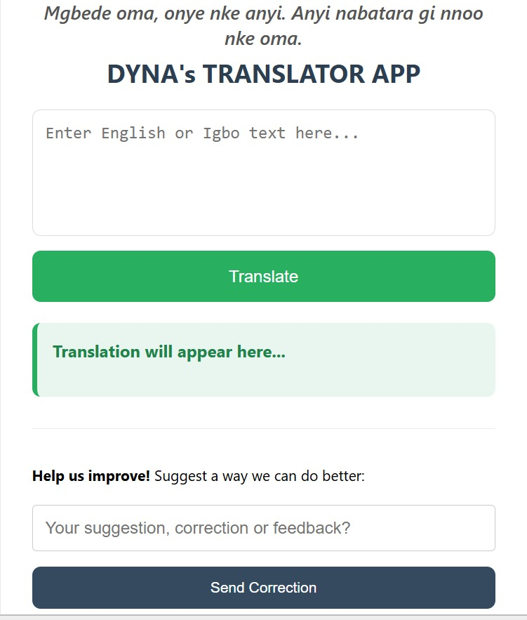
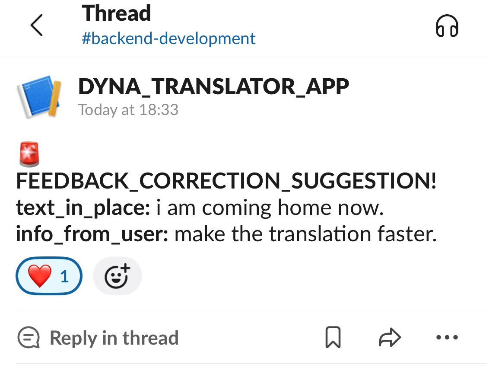

DYNA's TRANSLATOR APP is a Flask-powered English-to-Igbo translation platform built to preserve and promote the Igbo language. This isn't just a "find and replace" tool; it’s a culturally aware application that greets users natively based on the time of day and encourages users to contribute suggestions that help improve the translation dictionary over time.

## Why this exists
Most translation tools ignore African languages entirely. This app was built to 
bridge that gap for Igbo speakers using rule-based pattern matching with tonal 
and dialectal handling.

**Special Features:**
## Features

*Time-Based Cultural Greetings:*
Displays native Igbo greetings based on the user's local time.

*Dictionary-First Translation:*
Searches curated JSON dictionaries before using AI.

*AI Fallback:*
Uses Gemini 2.5 Flash whenever a translation is unavailable locally.

*Slack Feedback Integration:*
Sends user suggestions to a dedicated Slack channel using background threads.

*Intelligent Suggestions:*
Uses fuzzy matching to recommend the closest valid word.

*Responsive Design:*
Optimized for desktop and mobile browsers.

## APP/SLACK NOTIFICATION SCREENSHOT:

|            Translator App Screenshot            |                     Slack Notification Screenshot                      |
|:-----------------------------------------------:|:----------------------------------------------------------------------:|
|  |  |

> **NOTE:**: The screenshot on the left shows my app user interface, while the right shows the "swift" feedback loop in my dedicated `#backend-development\dyna_translator_app` channel.

  **The Technical Stack:**
## Tech Stack

Backend
- Python
- Flask

Frontend
- HTML
- CSS

AI
- Google Gemini 2.5 Flash

Libraries
- spaCy
- difflib
- unicodedata

Deployment
- Render

Notifications
- Slack Webhooks

Concurrency
- threading

## Development Challenges

- Installing spaCy on Windows
- Configuring Visual Studio Build Tools
- Handling Igbo diacritics
- Designing a hybrid translation engine

## How to run locally
1. Clone the repo
2. Create a virtual environment: `python -m venv venv`
3. Activate it: `venv\Scripts\Activate.ps1` (Windows) or `source venv/bin/activate` (Mac/Linux)
4. Install dependencies: `pip install -r requirements.txt`
5. Download spaCy model: `python -m spacy download en_core_web_sm`
6. Add environment variables: `GEMINI_API_KEY` and `SLACK_WEBHOOK_URL` in a `.env` file
7. Run: `python mainapp.py`
8. Visit http://127.0.0.1:5000

## Why this matters to me?
Igbo Language is my heritage, and I'm aiming to promote the culture in the way I can by building this translator app that embodies me and also getting to know how translator apps work.

 A nabatara m unu nnoo nke oma. (You are very welcome.)

